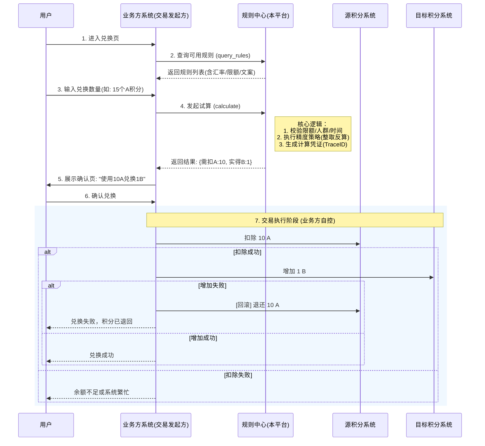

# 通用积分互兑规则中心 PRD (MVP v1.0)

**版本**：v1.0  
**状态**：待评审  
**主要维护人**：Trae (Product Architect)

## 1. 产品概述 (Overview)
本平台致力于解决多业务线积分资产不互通的问题，通过提供统一的**规则配置**与**汇率试算**服务，赋能业务方快速搭建积分互兑场景。MVP 阶段聚焦于规则的查询与计算，不直接持有资金，不直接操作扣款。

## 2. 核心业务流程图 (Core Flow)

## 3. 功能需求详情 (Requirements)

### 3.1 规则管理模型 (Rule Model)
支持双向兑换配置，即 `A->B` 和 `B->A` 为两条独立规则。

| 字段 Key | 字段名 | 类型 | 必填 | 说明/示例 |
| :--- | :--- | :--- | :--- | :--- |
| `rule_id` | 规则ID | String | Y | 全局唯一标识 |
| `source_asset` | 源资产 | Enum | Y | 枚举值：`MALL_POINT`, `GAME_COIN` |
| `target_asset` | 目标资产 | Enum | Y | 枚举值：`VIP_GROWTH`, `COUPON` |
| `exchange_rate` | 汇率 | Decimal | Y | **1单位源资产 = N单位目标资产**。 例：A换B是10:1，则rate=0.1 |
| `step_size` | 兑换步长 | Int | Y | **精度控制核心**。 源资产必须是此值的整数倍。 例：10:1场景，步长设为10。 |
| `min_amount` | 起兑门槛 | Int | N | 至少100积分起兑 |
| `daily_limit` | 单日限额 | Int | N | 用户单日最多获得多少目标积分 |
| `total_pool` | 总资金池 | Int | N | 活动总预算，换完即止 |
| `status` | 状态 | Enum | Y | ENABLE(生效), DISABLE(失效), DRAFT(草稿) |
| `start_time` | 生效时间 | Timestamp| Y | |
| `end_time` | 失效时间 | Timestamp| Y | |

### 3.2 核心接口设计 (API)

#### 3.2.1 查询规则列表 `POST /api/v1/rules/query`
*   **输入**：
    *   `source_asset` (可选): 筛选源积分类型
    *   `user_id` (可选): 用于未来扩展人群包过滤
*   **输出**：
    *   `rules`: List
        *   `rate_desc`: "10积分兑换1成长值" (后端拼装好文案，方便前端展示)
        *   `exchange_rate`: 0.1
        *   `step_size`: 10 (前端据此设置步进器)

#### 3.2.2 核心试算 `POST /api/v1/rules/calculate`
*   **输入**：
    *   `rule_id`: 规则ID
    *   `amount`: 用户输入的源积分数量 (如 15)
    *   `direction`: `SOURCE_TO_TARGET` (默认)
*   **逻辑 (精度解决方案)**：
    1.  校验规则有效期、状态。
    2.  校验 `amount >= min_amount`。
    3.  **计算**：
        *   `valid_input = floor(amount / step_size) * step_size`
        *   *解释：15 / 10 = 1.5 -> 取整 1 -> 乘 10 = 10。即只有10积分有效。*
        *   `target_amount = valid_input * exchange_rate`
    4.  **风控校验**：检查 `target_amount` 是否超过单日限额或总奖池。
*   **输出**：
    *   `source_deduct_amount`: 10 (建议业务方扣除的值)
    *   `target_grant_amount`: 1 (建议业务方发放的值)
    *   `remain_amount`: 5 (告知用户未被消耗的部分)
    *   `calc_token`: "token_xyz" (加密串，包含本次计算结果的签名，用于事后校验或日志关联)

## 4. 接入实施规范 (Implementation Guidelines)
*本部分作为开发文档提供给接入方*

1.  **一致性保障 (Consistency)**：
    *   业务方必须实现**正向交易**与**逆向回滚**。
    *   场景：调用源积分扣减成功，但调用目标积分发放失败（超时/报错）。
    *   **强制动作**：业务方系统必须捕获该异常，并自动调用源积分系统的“退款/加分”接口，将 `source_deduct_amount` 原路退回给用户。
2.  **前端交互建议**：
    *   输入框建议根据 `step_size` 设置步长。例如步长为10，用户点击“+”号直接增加10，避免输入15造成困惑。
    *   文案提示：“本次兑换消耗 10 积分，获得 1 成长值。（您输入的 15 积分中，5 积分不足兑换门槛已保留）”

